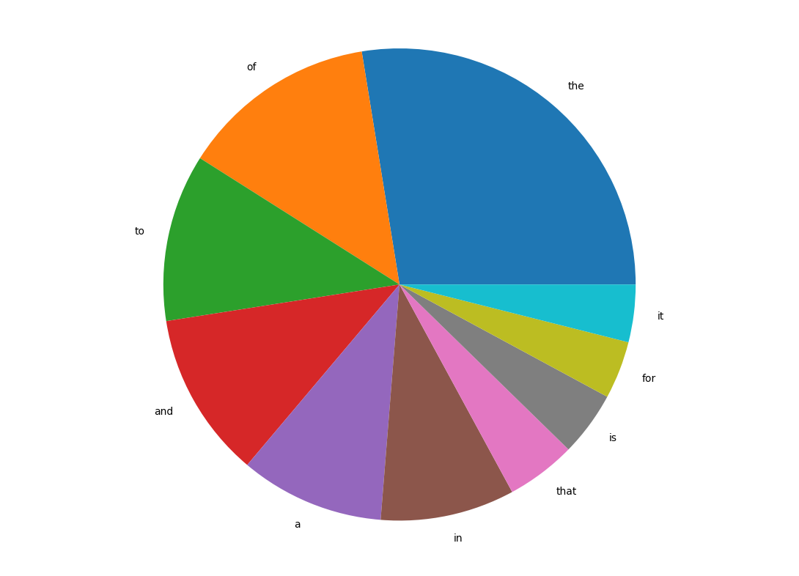
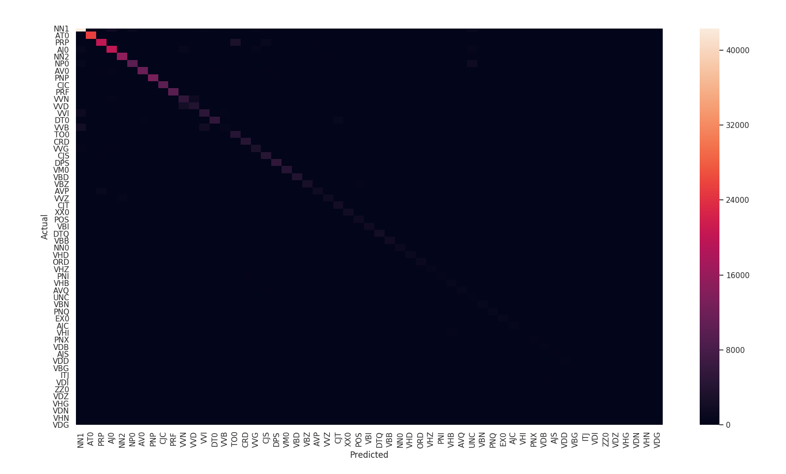

# Word Classifier

Word Classifier based on data tagged using British National Corpus(BNC)

## Run Instructions

```sh
pip install -r requirements.txt
./run.py
```

## Visualizations

### Top 10 words on a pie chart


### Confusion matrix visualized with seaborn heatmap
